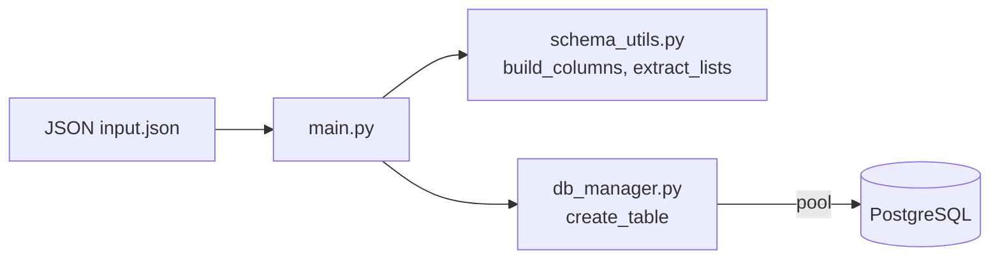

# JSON → PostgreSQL Table Creator

A small Python codebase that reads a JSON file, derives table/column definitions, and creates or updates PostgreSQL tables accordingly. No CLI framework is required—run `main.py` directly.

> **Author:** Harsha E  
> **Status:** Finalized (uses `db_manager.py` only)

---

## ⭐ Features
- Inspect a JSON payload (supports nested lists as **data-grids**).
- Infer column types from values (dates/times, numerics, JSON, etc.).
- Create one table per detected grid or a single table when no grids exist.
- Add only **missing columns** when tables already exist (idempotent).
- Mandatory baseline columns added to all tables (project/task context, audit fields).

---

## 🧭 High-Level Flow


**Behavior**
- Reads `input.json` → merges `submitted_data.data` if present.
- Detects **data-grids** (list-of-dicts) and creates a table per grid: `baseTable_gridName`.
- Builds column SQL with **mandatory columns** + inferred columns.
- Creates the table if missing; otherwise only **adds new columns**.

---

## 🗂️ Repository Structure
```
.
├─ config.py                # DB_CONFIG with connection parameters
├─ db_manager.py            # connection pool + create_table logic
├─ schema_utils.py          # build_columns, extract_lists, mandatory_columns, excluded_columns
├─ main.py                  # entrypoint; parses JSON and orchestrates
├─ input.json               # sample payload for testing
├─ requirements             # Python deps (psycopg2, python-dateutil)
└─ (other folders)
```

---

## ⚙️ Configuration (`config.py`)
Provide a `DB_CONFIG` dict:
```python
DB_CONFIG = {
    "host": "localhost",
    "port": 5432,
    "dbname": "postgres",
    "user": "postgres",
    "password": "<secret>"
}
```
> Connection pool defaults (in code): `minconn=1`, `maxconn=10`.

---

## 🧱 Database Layer (`db_manager.py`)
**Table creation & sync (simplified):**
1. `SELECT to_regclass('<table>')` to check existence.
2. If not exists → `CREATE TABLE IF NOT EXISTS <table> (<mandatory + columns>)`.
3. If exists → query `information_schema.columns` and `ALTER TABLE ... ADD COLUMN` for missing ones.
4. Commit; return connection to pool.

---

## 🧪 Schema Inference (`schema_utils.py`)
### Excluded Columns (never inferred as regular columns)
```
project_id, stage_id, task_id, task_status, step_name, row_num, inserted_datetime, date,
table_name, triggers, type, submitted_data, data, user_id, language, tz, project_type,
offline, stages, current_status, sample_size, fetch
```
### Mandatory Columns (added to every table)
```sql
project_id VARCHAR(1000) NOT NULL,
stage_id VARCHAR(1000) NOT NULL,
task_id VARCHAR(1000) NOT NULL,
task_status VARCHAR(1000),
step_name VARCHAR(1000),
row_num SERIAL,
inserted_datetime TIMESTAMP WITHOUT TIME ZONE DEFAULT CURRENT_TIMESTAMP,
date DATE,
data JSONB
```
### Type Inference Rules (selected)
- **bool** → _skipped_ (no column)
- **int** → `INTEGER`
- **float** → `NUMERIC(10, <scale>)` (scale from decimals)
- **str** → `DATE` | `TIMESTAMP WITHOUT TIME ZONE` | `TIME WITHOUT TIME ZONE` | `VARCHAR(1000)`
- **list/dict** → `JSONB`

### Special Cases
- **E‑signature dict** (contains `signature_id`) → emit three columns:
  - `"<field>" JSON`
  - `"<field>_name" VARCHAR(1000)`
  - `"<field>_date" TIMESTAMP WITHOUT TIME ZONE`
- **Lists of dicts** (datagrids) → infer columns from the **first element** keys.

---

## ▶️ How to Run
```bash
pip install -r requirements
python main.py
```
> Ensure the DB user has `CREATE` privileges on the target schema (default: `public`).

---

## 📄 JSON Expectations
**Minimal example**
```json
{
  "table_name": "orders",
  "customer_id": 123,
  "order_date": "2025-11-01T10:00:00Z",
  "notes": "priority",
  "items": [
    { "sku": "A1", "qty": 2, "price": 49.99 },
    { "sku": "B9", "qty": 1, "price": 9.99 }
  ]
}
```
**Behavior**
- Base table: `orders` (from `table_name`).
- Grid table: `orders_items` from the first row keys `{sku, qty, price}` plus common fields.

---

## 🧰 Worked Example (from `input.json`)
**Highlights**
- `table_name`: `table101`
- Datagrids: `dg1`, `dg2`
- Common field `analysed_by` is an e‑sign dict

**Tables Created**
- `table101_dg1`
- `table101_dg2`

**Columns Added**
- **Mandatory (both tables):** `project_id`, `stage_id`, `task_id`, `task_status`, `step_name`, `row_num`, `inserted_datetime`, `date`, `data`
- **Common (both tables):** `"analysed_by" JSON`, `"analysed_by_name" VARCHAR(1000)`, `"analysed_by_date" TIMESTAMP WITHOUT TIME ZONE`
- **`dg1`:**
  - `"dolomite_first_grade_type_moisture" VARCHAR(1000)`
  - `"dolomite_first_grade_equipment_moisture" VARCHAR(1000)`
  - `"invoice_no" VARCHAR(1000)`
  - `"dolomite_first_grade_analysed_time_moisture" TIME WITHOUT TIME ZONE`
  - `"dolomite_first_grade_parameters_cao" NUMERIC(10,2)`
  - `"dolomite_first_grade_parameters_mgo" INTEGER`
  - `"approved_by1" JSON`, `"approved_by1_name" VARCHAR(1000)`, `"approved_by1_date" TIMESTAMP WITHOUT TIME ZONE`
- **`dg2`:**
  - `"col1" VARCHAR(1000)`
  - `"col2" NUMERIC(10,3)`
  - `"col5" VARCHAR(1000)`
  - `"col4" VARCHAR(1000)`

---

## ⚠️ Limitations
- Adds **missing columns only**; no drops, renames, or type changes.
- For datagrids, only the **first element** determines grid schema.
- Pure boolean fields are skipped by inference.
- This is specifically designed for PGP projects. Please make the required changes before using the code in any other project. 

---

## 💡 Recommendations
- Consider using `JSONB` for dicts (currently `JSON`) for consistency and indexing options.
- Add `BOOLEAN` handling if you need boolean columns.
- Quote table/schema identifiers safely if upstream names can include uppercase/special chars.
- Optional: wrap each table’s DDL in a transaction.

---

## ✅ Acceptance Criteria (suggested)
- Creates tables with mandatory + inferred columns.
- Handles datagrids and e‑sign dicts correctly.
- Idempotent: re‑runs only add missing columns, without errors.

---

## 🧷 Troubleshooting
- **Table exists but missing columns** → on next run, missing columns are added via `ALTER TABLE ... ADD COLUMN`.
- **Permission errors** → ensure the DB user has `CREATE` on schema and `ALTER` on tables.
- **Unexpected type inference** → check sample values in the JSON (first grid row drives schema; datetime parsing is liberal).

---

## 📜 License
Add a license of your choice (e.g., MIT or Apache-2.0) at the repo root.
